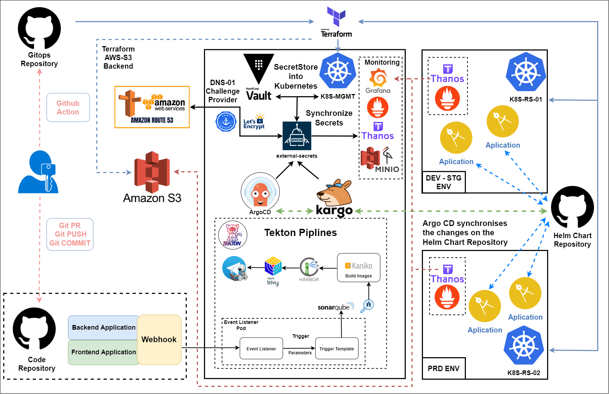

# Kubernetes Native CI/CD Pipeline Repository

This repository provides a full-stack automation solution for deploying and managing a native Kubernetes CI/CD pipeline triggered by GitHub webhooks. The system leverages industry-standard tools such as Hashicorp Terraform & Vault, Helm/Helmfile, Tekton, ArgoCD, Kargo and Harbor to streamline the process from code commit to production deployment.

---

## Pipeline Overview

This solution implements a CI/CD pipeline with the following high-level workflow:

1. **GitHub Webhook Trigger**  
   GitHub sends a webhook event (e.g., on code commits or pull requests) to the system, triggering the pipeline.

2. **Tekton Trigger Listener**  
   Tekton triggers (defined in `configs/tekton/triggers/`) capture the webhook event and start the pipeline execution.

3. **Pipeline Execution via Tekton**  
   The Tekton pipeline (`configs/tekton/pipeline/dev-ci-pipeline.yaml`) executes a series of tasks:
   - **Git Clone**: Clones the repository to fetch the latest code.
   - **SonarQube Scan**: Performs static code analysis using SonarQube to identify code smells, bugs, and security vulnerabilities.
   - **Extract Version**: Retrieves version information from the source code.
   - **Image Build**: Uses Kaniko to build container images.
   - **Push to Harbor Private**: Pushes the built container images to the private Harbor registry.
   - **Trivy Image Scan**: Scans the container images using Trivy to detect vulnerabilities.
   - **Notification**: Send notification to Telegram.
   - **ArgoCD + Kargo**: Take over the continuous deployment (CD) process. They manage deployments across multiple Kubernetes clusters and environments, supporting matrix deployments and multi-environment promotions.
---
